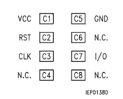

# Wiring (direct card connection)

This document describes the wiring used when the Raspberry Pi Pico/Pico W is directly connected to an SLE4442 card.

> Voltage note: this wiring assumes a **3.3V** system.
> If your card/adapter requires **5V**, do **not** connect signals directly to RP2040 GPIO.
> Use proper **level shifting** for IO/CLK/RST and ensure IO’s open-drain behavior is preserved.

---

## Signals

- **IO**: bidirectional data line (open-drain style on many setups)
- **CLK**: clock generated by the Pico
- **RST**: reset line driven by the Pico
- **VCC / GND**: power

SLE4442 card contact often referenced as:
- **C1 = VCC**
- **C2 = RST**
- **C3 = CLK**
- **C5 = GND**
- **C7 = I/O** (my pull-up was placed here)

---

## My direct-to-card wiring (recommended for stability)

### Required connections
- Pico **3.3V** → Card **VCC (C1)**
- Pico **GND** → Card **GND (C5)**
- Pico **IO pin** → Card **IO (C7)**
- Pico **CLK pin** → Card **CLK (C3)**
- Pico **RST pin** → Card **RST (C2)**

### Added components (my setup)
1) **Pull-up on IO (C7) to 3.3V**
   - Purpose: improves rising edges on open-drain IO
   - Typical values: 4.7k–10k are common in many designs (use what works in your setup)

2) **Series resistors (1 kΩ) on IO / CLK / RST**
   - Inserted between the connector (card side) and the Pico pins
   - Purpose:
     - reduces ringing/overshoot
     - limits current during accidental contention
     - helps signal integrity on short jumper wires

3) **Bulk capacitor: 100 µF between 3.3V and GND**
   - Place as close as practical to the card/power injection point
   - Purpose:
     - stabilizes supply during transients
     - reduces brownouts/noise on breadboard wiring

---

## If your target is 5V (IMPORTANT)

If the card/adapter uses **5V**:
- RP2040 GPIO inputs are **not 5V tolerant**
- Use:
  - a proper **level shifter** (recommended)
  - and a solution that works with **bidirectional/open-drain IO** (for IO line)

---

## Practical tips

- Keep wiring short and solid.
- If reads are unstable:
  - increase `T_US` (clock delay) in software
  - verify pull-up strength on IO
  - ensure the capacitor is actually on the 3.3V rail near the load
